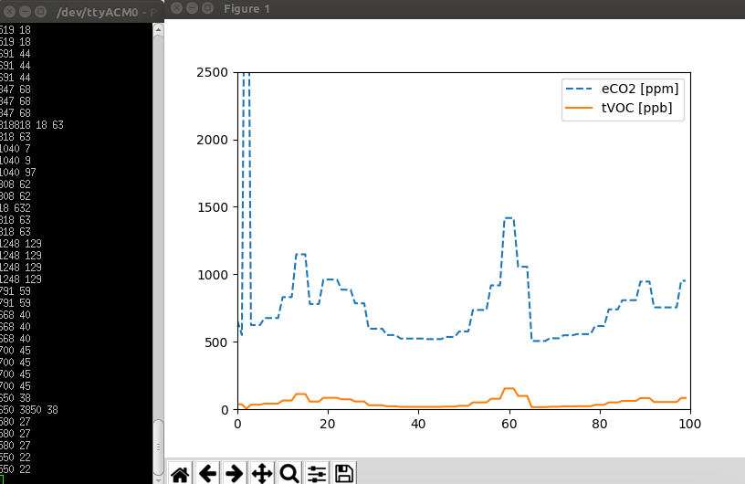

# II-Ambient-Intelligence-
## General info
#### Openhab

  -mqtt  
    Services toevoegen: 
    in /etc/openhab2/services
	    Mqtt.cfg
    	# URL to the MQTT broker, e.g. tcp://localhost:1883 or ssl://localhost:8883
      #<broker>.url=tcp://<host>:1883
    opehabmqtt.url=tcp://localhost:1883
    
    Items toevoegen: /etc/openhab2/items
	    Hier een .items file aanmaken
	  Mqtt: 
      Number temperature "temp7 [%.1f]" mqtt="<[opehabmqtt:tempdash7:state:default]" }
      
        "}
    Restart openhab na elke aanpassing om in te laden:
      pi@raspberrypi:~ $ sudo systemctl stop openhab
      pi@raspberrypi:~ $ sudo systemctl start openhab
      pi@raspberrypi:~ $ sudo systemctl enable openhab
      pi@raspberrypi:~ $ sudo systemctl status openhab

#### MEMS-sensor

 -Raspberry
    Build en run: /home/pi/rpi-mems-sensor/test.c
    gcc -o tempProg test.c libmemssensor.a -l bcm2835 
    sudo ./tempProg
    
## Project folders: 
#### Nucleo-project	
Dash7, USART, Interrupts and GPIO	

#### airQuality-nucleo-l152-i2c-usart
Eclipse project for the air quality sensor.

Readouts are not yet interrupt based

output format:

CO2-data TVOC-data

#### barometer
